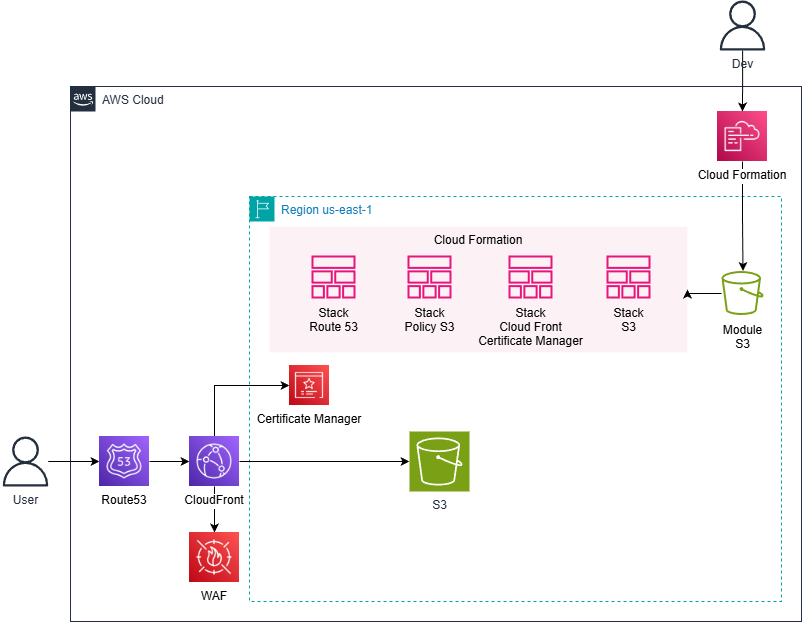

# ☁️ Infrastructure as Code & CI/CD - Cloud Formation - Site Filmes 1/1

## 📌 Sobre o Projeto

Este repositório faz parte do projeto **Site Filmes AWS**, onde foi construída uma aplicação completa utilizando serviços da AWS.

O projeto evolui de um **site estático (front-end)** para uma **plataforma completa (front + backend)** utilizando boas práticas de:

- Infraestrutura como Código (IaC)  
- Automação (CI/CD)  
- Arquitetura em nuvem  

---

## 🧠 Objetivo do Projeto

Demonstrar, na prática, como construir uma aplicação completa na AWS utilizando:

- Front-end hospedado na nuvem  
- Backend serverless  
- Infraestrutura automatizada com CloudFormation  
- Pipeline de deploy com GitHub Actions  
- Separação de ambientes (DEV e PRD)  

---

## 🚀 Etapas do Projeto

### 1. CloudFormation (Infraestrutura como Código)

Nesta etapa, toda a infraestrutura foi criada utilizando arquivos YAML no CloudFormation.

Os templates foram enviados diretamente via upload no console, com explicação detalhada de:

Recursos criados
Propriedades utilizadas
Integração entre serviços

📌 Aqui transformamos a infraestrutura manual em código.

### 2. GitHub
Versionamento do projeto.

### 3. GitHub Actions
Automação de deploy (CI/CD).

### 4. Ambientes
Separação entre DEV e PRD.


---

## 🏗️ Arquitetura do Projeto

### 🎨 Front-end (Site Estático)

- Amazon S3  
- Amazon CloudFront  
- AWS Certificate Manager  
- Amazon Route 53  
- AWS WAF  

### ⚙️ Back-end (Serverless)

- Amazon API Gateway  
- AWS Lambda  
- Amazon DynamoDB  

### ☁️ Infraestrutura & DevOps

- AWS CloudFormation  
- GitHub  
- GitHub Actions  

---

## 📁 Estrutura do Projeto

```
aws-filmes-platform/
|
├── s3.yaml
├── cloudfront.yaml
├── policy.yaml
├── route53.yaml
├── LICENSE
├── README.md


```

---

## 🔄 Fluxo do Projeto

1. CloudFormation  
2. GitHub  
3. GitHub Actions  
4. Ambientes DEV e PRD  
5. Deploy do front no S3  
6. Backend com Lambda + API Gateway  

---

## 📜 Licença

MIT

---

## 👨‍💻 Autor

**Luiz Augusto Souza**

* 💼 LinkedIn: Link
* 💻 YouTube: Link